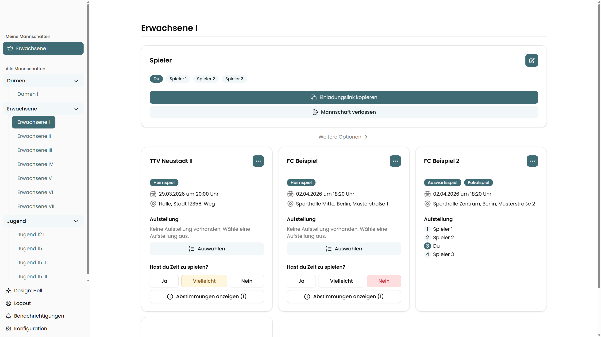

# Tischtennis-Manager — Frontend

Webbasierte Team-Management-App für Tischtennis-Vereine. Dieses Repository enthält das Frontend und ist der Nachfolger des ursprünglichen Monorepos [JurIVoelker/tischtennis-manager](https://github.com/JurIVoelker/tischtennis-manager).

Das zugehörige Backend befindet sich unter [JurIVoelker/ttm-backend](https://github.com/JurIVoelker/ttm-backend).



## Funktionsübersicht

### Für Spieler
- Spielplan der eigenen Mannschaft einsehen
- Verfügbarkeit für Spiele angeben (Zusagen / Absagen)
- Aufstellung und Spieldetails ansehen
- Push-Benachrichtigungen aktivieren (iOS & Android) (Momentan unter Entwicklung)

### Für Mannschaftsführer
- Mannschaftsmitglieder verwalten
- Spiele erstellen, bearbeiten und löschen
- Aufstellung für Spiele festlegen (mit Drag & Drop)
- Einladungslinks für Spieler generieren
- Spielerinformationen per Link teilen

### Für Admins
- Mannschaften anlegen und verwalten
- Mannschaftsführer zuweisen
- Admin-Accounts verwalten
- Spielerdaten aus externen Quellen synchronisieren
- Spielerpositionen je Mannschaftstyp pflegen

## Rollen & Zugriffsrechte

| Rolle | Berechtigung |
|---|---|
| `player` | Lesezugriff + Verfügbarkeitsabstimmung |
| `leader` | Verwaltung der eigenen Mannschaft(en) |
| `admin` | Vollzugriff auf alle Bereiche |

## Tech Stack

| Bereich | Technologie |
|---|---|
| Framework | Next.js 15 (Pages Router) |
| React | React 19 |
| Sprache | TypeScript 5 (strict) |
| Styling | Tailwind CSS 4 + CSS-Variablen (oklch) |
| UI-Komponenten | shadcn/ui (new-york, neutral) |
| State | Zustand 5 |
| Datenabruf | TanStack React Query 5 |
| Formulare | React Hook Form 7 + Zod 4 |
| Icons | Lucide React + Hugeicons |
| Drag & Drop | @dnd-kit |
| Toasts | Sonner |
| Theme | next-themes |
| Build | Turbopack |

## Lokale Entwicklung

```bash
# Abhängigkeiten installieren
bun install

# Entwicklungsserver starten
bun dev
```

Die App läuft unter [http://localhost:3000](http://localhost:3000).

## Authentifizierung

- **Spieler**: Login per Einladungslink (Invite-Token)
- **Mannschaftsführer**: Login per E-Mail/Passwort oder Google OAuth2
- **Admins**: Login per E-Mail/Passwort oder Google OAuth2
- JWT (HS256) mit Refresh-Tokens in HTTP-only Cookies
